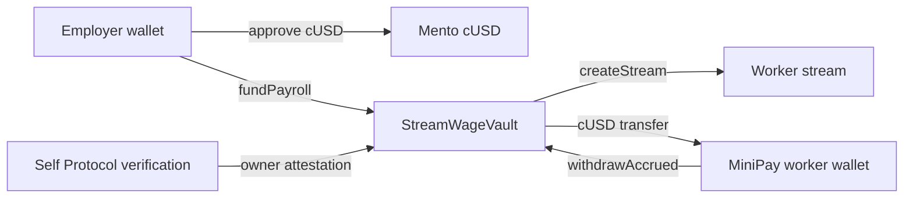

# StreamWage

Real-time salary streaming in Mento cUSD on Celo, claimable from MiniPay.

StreamWage lets an employer fund a Celo Sepolia payroll vault with cUSD, mark a worker as Self-verified, create a per-second wage stream, and let that worker claim accrued cUSD into their wallet whenever they want.

## Architecture



## Celo Sepolia Deployment

- Chain: Celo Sepolia, chain ID `11142220`
- RPC: `https://forno.celo-sepolia.celo-testnet.org`
- Explorer: `https://celo-sepolia.blockscout.com`
- Mento cUSD: `0xdE9e4C3ce781b4bA68120d6261cbad65ce0aB00b`
- StreamWageVault: `0xe539898822e5842477D288D2e66758fe5CE69e47`
- Verified contract: `https://celo-sepolia.blockscout.com/address/0xe539898822e5842477d288d2e66758fe5ce69e47`
- Live app: `https://streamwage.pages.dev`

Deploy:

```bash
~/.claude/vault/inject.sh get CELO_DEPLOYER_PRIVATE_KEY CELO_SEPOLIA_RPC --dir .
forge script script/DeployStreamWage.s.sol:DeployStreamWage \
  --rpc-url "${CELO_SEPOLIA_RPC:-https://forno.celo-sepolia.celo-testnet.org}" \
  --broadcast \
  --verify \
  --verifier blockscout \
  --verifier-url https://celo-sepolia.blockscout.com/api/
```

## Local Development

```bash
npm install
npm run dev
```

Optional env:

```bash
cp .env.example .env
```

Set `VITE_STREAMWAGE_VAULT_ADDRESS` after deployment so the UI can call the vault.

## Tests

```bash
forge test
npm test
npm run build
```

## MiniPay

`src/hooks/useMiniPay.ts` detects `window.ethereum.isMiniPay`, connects the injected provider, and keeps the worker claim screen focused on the claim action. Desktop wallets remain available for employer setup and local proof.

## Self Protocol

The contract enforces verified-worker creation via `isVerifiedWorker`. The current implementation records Self verification with `setWorkerVerification(worker, true)` after a verified Self flow for scope `streamwage`. A production callback/QR service is still tracked in `BLOCKERS.md`.

## Status

Current classification: `demo-ready`.

See:

- `FEATURE_MATRIX.md`
- `INTEGRATION_MATRIX.md`
- `TRUTH_AUDIT.md`
- `QUALITY_GATE.md`
- `BLOCKERS.md`
- `TEST_ME.md`
