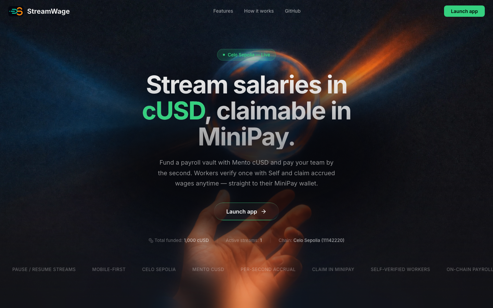
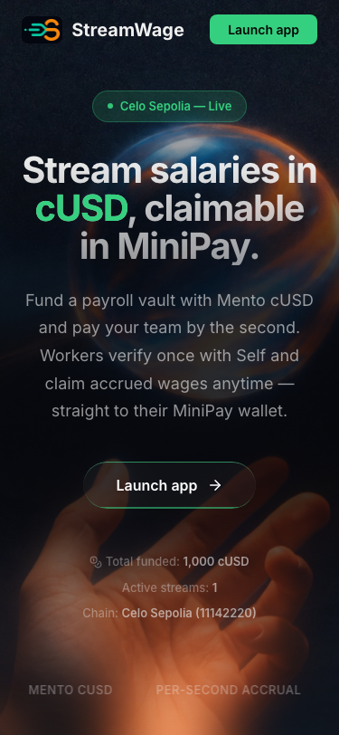
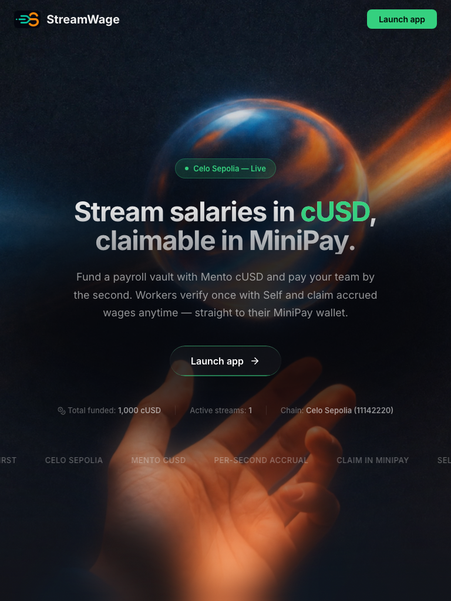
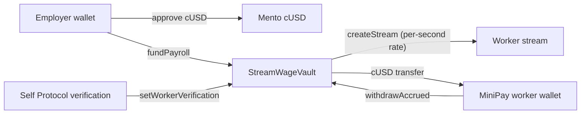

# StreamWage

**Real-time salary streaming in Mento cUSD on Celo, claimable from MiniPay.**

StreamWage lets an employer fund a Celo payroll vault with cUSD, verify a worker
with **Self Protocol**, open a **per-second** wage stream, and let that worker
**claim accrued cUSD into MiniPay** whenever they want — no payday, no waiting.

- **Track:** Stablecoin Payments + MiniApp
- **Why Celo:** mobile-first stablecoin payroll for the next billion workers
- **Live app:** https://streamwage.pages.dev



<p align="center">
  
  &nbsp;
  
</p>

## What you can do

- **Landing → connect → app shell → employer dashboard → worker claim** — a full
  multi-screen product, not a one-pager.
- **Employer:** fund payroll (approve + `fundPayroll`), verify workers with Self,
  create per-second cUSD streams, pause/resume streams, watch a live treasury
  panel (reserve, total funded, monthly outflow, payroll runway gauge).
- **Worker:** see wages accrue by the second and **claim accrued cUSD** in one tap
  — works inside MiniPay's in-app browser.
- **Live on-chain:** activity feed + transaction explorer read real Celo events;
  the landing hero shows live `totalFunded` / active-stream counts.

## Architecture



The contract exposes a full read surface so the UI renders a rich product:
`nextStreamId`, `streams(id)` → `(payee, ratePerSecond, accrued, lastUpdated,
paused, exists)`, `payrollReserve`, `totalFunded`, `totalStreamRate`,
`pending(id)`, `isVerifiedWorker(addr)`. Every state change emits an event
(`PayrollFunded`, `WorkerVerificationSet`, `StreamCreated`, `StreamPaused`,
`StreamResumed`, `Claimed`).

**Security:** OpenZeppelin `Ownable` + `ReentrancyGuard` + `SafeERC20`,
checks-effects-interactions in `withdrawAccrued`, custom errors, no hardcoded
secrets (deployer key injected from a vault at deploy time).

## Celo Sepolia Deployment (verified)

| Item                           | Value                                                                                                                                              |
| ------------------------------ | -------------------------------------------------------------------------------------------------------------------------------------------------- |
| Chain                          | Celo Sepolia · chain ID `11142220`                                                                                                                 |
| RPC                            | `https://forno.celo-sepolia.celo-testnet.org`                                                                                                      |
| Explorer                       | `https://celo-sepolia.blockscout.com`                                                                                                              |
| **StreamWageVault**            | [`0x5eAfDC8D612c8c2860cE8002516737e413B07c67`](https://celo-sepolia.blockscout.com/address/0x5eAfDC8D612c8c2860cE8002516737e413B07c67) ✅ verified |
| **cUSD (testnet)**             | [`0x5127B7B034Cf9798c58948B64359a2Bf6285518d`](https://celo-sepolia.blockscout.com/address/0x5127B7B034Cf9798c58948B64359a2Bf6285518d) ✅ verified |
| Mento USDm (mainnet candidate) | [`0xdE9e4C3ce781b4bA68120d6261cbad65ce0aB00b`](https://celo-sepolia.blockscout.com/address/0xdE9e4C3ce781b4bA68120d6261cbad65ce0aB00b)             |
| Live app                       | https://streamwage.pages.dev                                                                                                                       |

> **cUSD note:** the testnet vault uses a **mintable cUSD** token so the full
> fund → claim flow is exercisable on-chain (the deployer holds 0 canonical Mento
> USDm and Celo Sepolia has no faucet for it). The canonical Mento token is wired
> as the mainnet/production candidate. See `DECISIONS.md`.

### On-chain proof (real transactions, exercised end-to-end)

| Step                      | Tx                                                                                                                         |
| ------------------------- | -------------------------------------------------------------------------------------------------------------------------- |
| approve                   | [`0x91c1ea2c…`](https://celo-sepolia.blockscout.com/tx/0x91c1ea2c233e1d45d97beb03da1f6e65551ca57cc2362643563c5a092b2e0ac9) |
| fundPayroll (1000 cUSD)   | [`0x319031ca…`](https://celo-sepolia.blockscout.com/tx/0x319031ca9542b9df501a64aac663679248910f2897d8fad356320ceace4b9353) |
| setWorkerVerification     | [`0x94a2e199…`](https://celo-sepolia.blockscout.com/tx/0x94a2e1991a3218c9da43c7f153df6cfa550ab2be128243ffc9c099a5120ac34d) |
| createStream (0.1 cUSD/s) | [`0x1ac601f1…`](https://celo-sepolia.blockscout.com/tx/0x1ac601f17700a22e3e9b06fba6780e4067f4bd52041c9f984244b17a0d6f1fd6) |
| withdrawAccrued (claim)   | [`0xcb29b4bf…`](https://celo-sepolia.blockscout.com/tx/0xcb29b4bf41512ea8f55971e23407d94d35e9d5d64eda9ec08370b925bb35cc47) |

## Tech stack

React + TypeScript + Vite · viem + wagmi + RainbowKit · hand-rolled CSS design
system (no Tailwind/shadcn) · Foundry (OpenZeppelin) · `@selfxyz/qrcode` ·
Cloudflare Pages.

## Setup

```bash
npm install
cp .env.example .env   # addresses are pre-filled; set VITE_WALLETCONNECT_PROJECT_ID if you have one
npm run dev
```

## Deploy the contracts

```bash
~/.claude/vault/inject.sh get CELO_DEPLOYER_PRIVATE_KEY CELO_SEPOLIA_RPC --dir .
set -a; . ./.env.local; set +a
forge script script/DeployStreamWage.s.sol:DeployStreamWage \
  --rpc-url https://forno.celo-sepolia.celo-testnet.org \
  --broadcast --private-key "$CELO_DEPLOYER_PRIVATE_KEY"
# Leave CUSD_ADDRESS unset to deploy a fresh mintable cUSD; set it to reuse a token.
```

## Tests

```bash
forge test     # 7 contract tests (fund, verified/unverified createStream, accrual, claim, pause/resume)
npm test       # frontend unit tests (vitest)
npm run build  # type-check + production build
```

## MiniPay

`src/hooks/useMiniPay.ts` detects `window.ethereum.isMiniPay`, auto-connects the
injected provider, and hides the connect/disconnect UI inside MiniPay so the
worker lands straight on their claim screen.

## Self Protocol

`createStream` reverts unless `isVerifiedWorker[worker]` is true. The Add Employee
flow renders a real Self verification QR (`@selfxyz/qrcode`, scope `streamwage`);
the employer records the result on-chain with `setWorkerVerification`, which
unlocks stream creation. A hosted Self callback service is tracked in
`BLOCKERS.md`.

## Repo docs

`DECISIONS.md` · `BLOCKERS.md` · `TEST_ME.md` · `FEATURE_MATRIX.md` ·
`INTEGRATION_MATRIX.md` · `outputs/deployment.json`

## License

MIT — see `LICENSE`.
